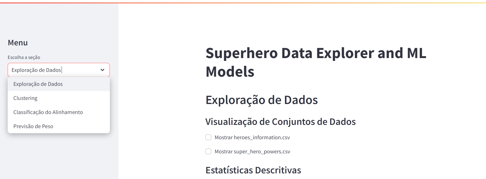

# super-heros
exploração nos datasets do kaggle super-heros

Neste repositório encontram-se 2 arquivos:

1- superhero.ipynb - Notebook onde se encontra todo desenvolvimento e explicações das análises.

2- app.py - Aplicação streamlit para rodar e verificar as analises e fazer previsoes com modelos encontrados no notebook de forma interativa.

Para rodar a aplicação , basta digitar na linha de comando, no mesmo diretorio onde se encontra o arquivo app.py (ou indicando o caminho), 
o seguinte comando:

```bash
streamlit run app.py
````

OBS: Certificar de ter o python com pacotes básicos instalados e o proprio streamlit.

A tela inicial abaixo se abrirá e no canto superior esquerdo pode-se escolher o modelo a se explorar.



